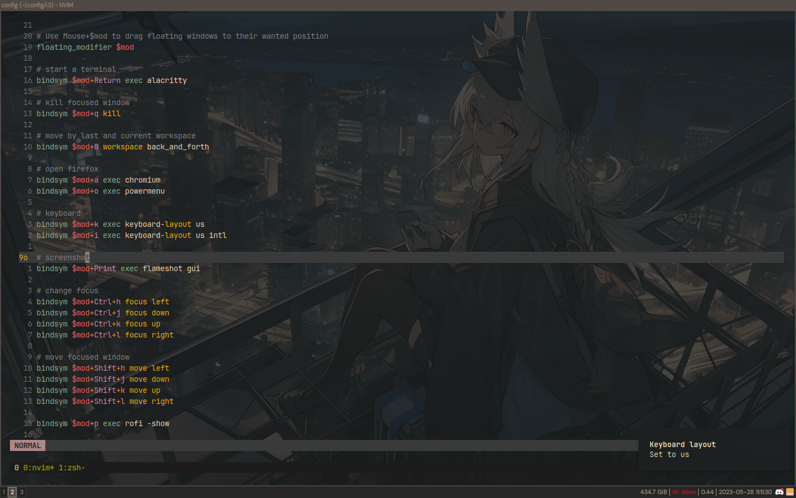

<div align="center">

# datsfilipe’s dotfiles


<br/>
<br/>



</div>

## Structure

```
.
├── lib
├── hosts
├── home
│   ├── base
│   │   ├── core
│   │   ├── tui
│   │   ├── gui
│   │   └── home.nix
│   └── linux
│       ├── base
│       ├── gui
│       ├── core.nix
│       ├── gui.nix
│       └── tui.nix
├── modules
│   ├── nix-user-pkgs
│   ├── nixos
│   │   ├── base
│   │   └── desktop
│   └── shared
│       ├── base
│       ├── theme
│       ├── config
│       └── shells
├── vars
│   └── default.nix
├── flake.nix
├── flake.lock
├── README.md
└── LICENSE
```
## Star History

<a href="https://star-history.com/#datsfilipe/dotfiles&Date">
  <picture>
    <source media="(prefers-color-scheme: dark)" srcset="https://api.star-history.com/svg?repos=datsfilipe/dotfiles&type=Date&theme=dark" />
    <source media="(prefers-color-scheme: light)" srcset="https://api.star-history.com/svg?repos=datsfilipe/dotfiles&type=Date" />
    
  </picture>
</a>
