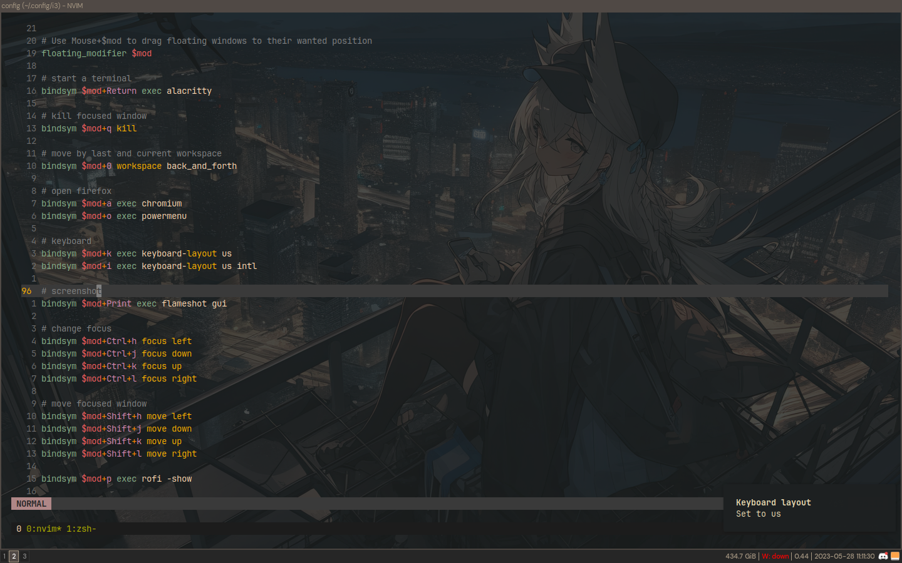

<div align="center"\>

# datsfilipe dotfiles


<br>
<br>



</div>

## Structure

```
.
├── assets
├── hosts
│   ├── dtsf-laptop
│   ├── dtsf-pc
│   └── dtsf-server
├── lib
├── modules
│   ├── core
│   │   ├── boot
│   │   ├── misc
│   │   ├── nix
│   │   ├── security
│   │   ├── shell
│   │   ├── system
│   │   └── user
│   ├── desktop
│   │   ├── addons
│   │   ├── display-manager
│   │   ├── fonts
│   │   ├── wallpaper
│   │   └── wms
│   ├── editors
│   ├── hardware
│   │   ├── audio
│   │   ├── bluetooth
│   │   ├── machine
│   │   ├── monitors
│   │   └── nvidia
│   ├── programs
│   ├── secrets
│   └── themes
├── outputs
│   └── x86_64-linux
│       └── src
├── pkgs
├── scripts
├── templates
└── vars
```

### General directories

- `assets`: images and other assets used in the readme.
- `hosts`: hosts definitions (entry points for configurations).
- `lib`: utility functions, including the recursive module scanner (`file.nix`).
- `modules`: feature-based configuration modules (Vertical Slices).
  - `core`: base system definitions (boot, nix settings, security).
  - `desktop`: window managers (niri, i3, sway), addons (astal, dunst), wallpaper, and desktop-specific configs.
  - `editors`: text editor configurations (neovim).
  - `hardware`: hardware abstraction (audio, bluetooth, nvidia).
  - `programs`: gui apps, cli tools, and terminal emulators.
  - `secrets`: secrets module using sops.
  - `themes`: centralized theming logic.
- `outputs`: outputs of the config.
- `pkgs`: custom packages and scripts.
- `scripts`: maintenance and utility scripts.
- `templates`: flake templates.
- `vars`: global variables used in the config.

### General slices

The repository now uses a **Vertical Slice** architecture. Instead of separating by layer (home/system), files are organized by feature.

  - **File Naming Convention**:
      - `os.nix`: Contains **NixOS** configurations (services, drivers, portals, users).
      - `user.nix`: Contains **Home Manager** configurations (programs, dotfiles, themes).
      - `default.nix`: Shared logic or variables.
  - **Module Categories**:
      - `core`: Essential system components required for the OS to function.
      - `desktop`: Everything related to the graphical environment.
      - `hardware`: Hardware-specific configurations.
      - `programs`: User-facing applications.
      - `themes`: Theming logic applicable to both OS and User layers.

### Usage

- To add a new host, create a host definition in `hosts/`. You can now toggle features by importing the scanner and enabling specific modules (e.g., `modules.desktop.wms.niri.system.enable = true`).
- `nixos-generate-config` can be used to generate a new host hardware configuration file.
- This repository submodules use ssh url's, so you need to update it as needed.
- `flake.nix` should never be edited manually, as it is generated by `just generate-flake` using `templates/flake.template.nix`.

## Star History

<a href="https://star-history.com/#datsfilipe/dotfiles&Date">
<picture>
<source media="(prefers-color-scheme: dark)" srcset="https://api.star-history.com/svg?repos=datsfilipe/dotfiles&type=Date&theme=dark" /\>
<source media="(prefers-color-scheme: light)" srcset="https://api.star-history.com/svg?repos=datsfilipe/dotfiles&type=Date" /\>

</picture>
</a>
