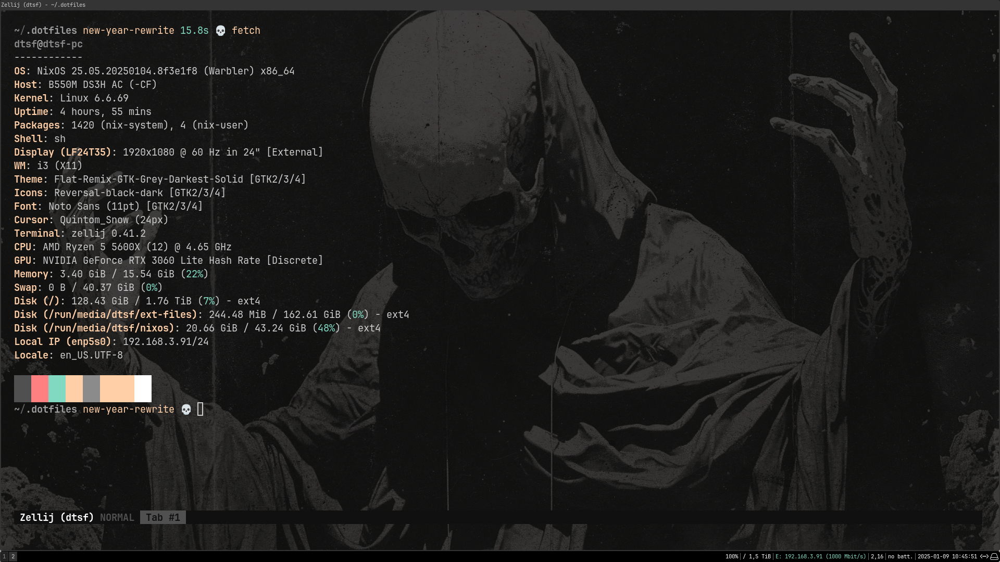

<div align="center">

# datsfilipe’s dotfiles


<br/>
<br/>



</div>

## Structure

```
.
├── assets
├── hosts
│   └── dtsf-pc
│       └── home
├── lib
├── modules
│   ├── home
│   │   ├── base
│   │   │   ├── core
│   │   │   ├── gui
│   │   │   └── tui
│   │   └── linux
│   │       ├── base
│   │       └── gui
│   ├── colorscheme
│   │   ├── integrations
│   │   └── themes
│   ├── conf
│   │   └── integrations
│   ├── nixos
│   │   ├── base
│   │   └── desktop
│   ├── nupkgs
│   │   ├── devtunnel-cli
│   │   └── zellij-switch
│   ├── secrets
│   └── wallpaper
├── outputs
│   └── x86_64-linux
│       └── src
├── scripts
└── vars
```

### General directories

- `assets`: images and other assets used in the readme.
- `hosts`hosts definitions.
- `lib`: utility functions.
- `modules`: modules definitions.
    - `home`: home manager general configurations.
    - `colorscheme`: colorscheme configurations for most used applications.
    - `conf`: configurations for most used applications.
    - `devenvs`: development environments.
    - `nixos`: nixos general configurations.
    - `nupkgs`: "nix user packages" - using that instead of a nur repo.
    - `secrets`: secrets module, using sops for encryption.
    - `wallpaper`: wallpaper definition.
- `outputs`: outputs of the config.
- `scripts`: scripts used in the config.
- `vars`: variables used in the config.

### General slices

- `base`: base configurations.
- `gui`: gui configurations.
- `tui`: tui configurations.
- `linux`: linux configurations.
- `desktop`: desktop configurations.
- `integrations`: module integrations.
- `conf`: config files needed for a function, derivation, etc.
- `spec`: test files.

### Usage

- To add a new host, need to create host definition and output. Refer to existing hosts as an example.
- `nixos-generate-config` can be used to generate a new host hardware configuration file.
- This repository submodules use ssh url's, so you need to update it as needed.
- `flake.nix` should never be edited manually, as it is generated by `just generate-flake` using `templates/flake.template.nix`.

## Star History

<a href="https://star-history.com/#datsfilipe/dotfiles&Date">
  <picture>
    <source media="(prefers-color-scheme: dark)" srcset="https://api.star-history.com/svg?repos=datsfilipe/dotfiles&type=Date&theme=dark" />
    <source media="(prefers-color-scheme: light)" srcset="https://api.star-history.com/svg?repos=datsfilipe/dotfiles&type=Date" />
    
  </picture>
</a>
