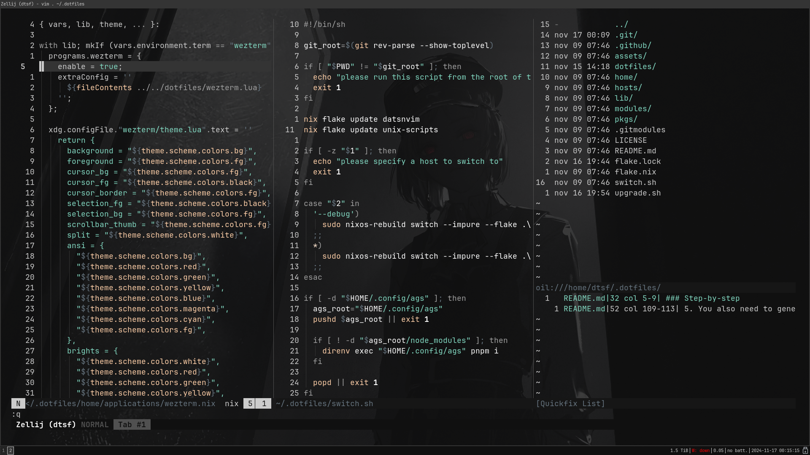

# DATSNVIM

This is a personal configuration for Neovim. You can use it as starting point for yours, you can use it as yours, etc. Feel free to use it as you wish.

## Preview



*Note: using [vesper](https://github.com/datsfilipe/vesper.nvim) in the screenshot.*

## Installation

Simple run the following on you terminal (I expect you have `git` cli installed and is using a linux OS or similar):

```bash
git clone https://github.com/datsfilipe/datsnvim.git ~/.config/nvim && nvim
```

## License

Refer to [LICENSE](./LICENSE).
