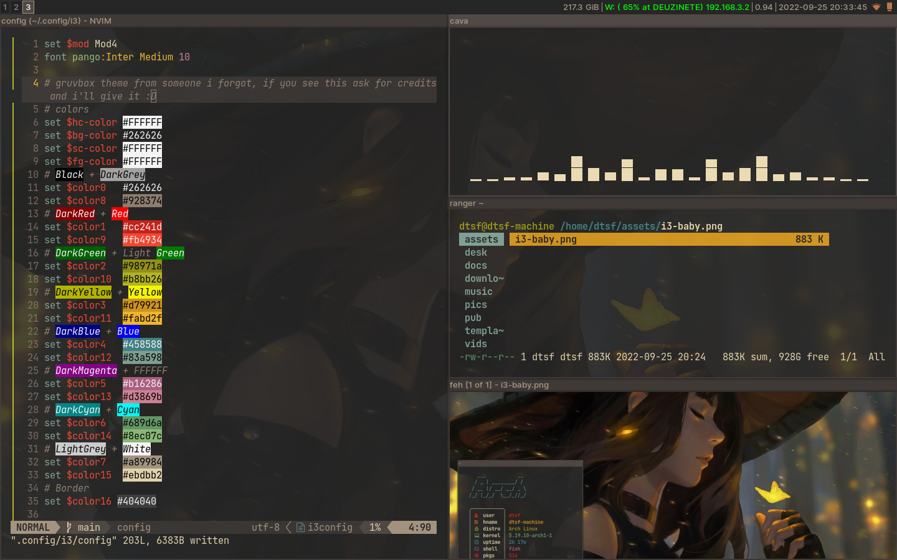

# How It Looks


*Note: Hatsune Miku!*

# Workspaces

1. For when I'm not working, just watching videos or other activity;
2. Browser, navigating on the web doing work/study;
3. Text editor, coding, neovim workspace;
4. Another tmux session with only terminals;
5. Playing music, nowadays it's another tmux session with mpv playing songs;
6. Navigating in directories, saving, copying, etc (currently I don't have a file browser);
7. Discord, of course;
8. Any work app, chat, email, hub, whatever;
9. When correlated windows are from same app or logic, keep them there.

# Setup tools:

```bash
paru -S peco lldb asdf-vm docker alacritty tmux fish i3-wm bspwm polybar dunst sxhkd rofi ranger dragon-drop xclip openssh neovim ttf-font-awesome # and others ...

# asdf version manager
asdf plugin add ghq && asdf install ghq latest
asdf plugin add nodejs https://github.com/asdf-vm/asdf-nodejs.git && asdf install nodejs lts
asdf plugin-add pnpm && asdf install pnpm latest
asdf plugin-add rust https://github.com/code-lever/asdf-rust.git && asdf install rust latest
asdf plugin-add github-cli https://github.com/bartlomiejdanek/asdf-github-cli.git && asdf install github-cli latest

# pnpm packages
pnpm install -g commitizen cz-conventional-changelog rustywind cspell@latest eslint_d

# cargo packages
cargo install stylua

# docker
sudo systemctl enable docker
sudo systemctl start docker
sudo usermod -aG docker $USER
```
